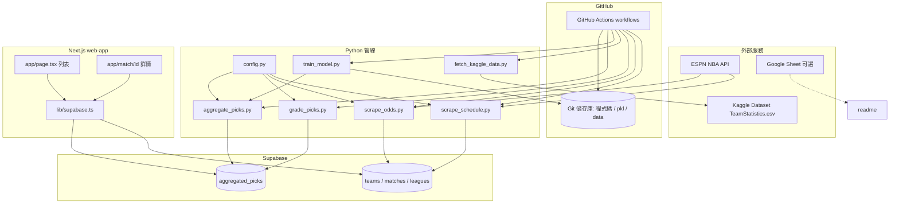

# sports-predictor 系統架構說明

本文檔說明 **sports-predictor** 專案的資料流、檔案職責（含 Input / Output）、架構圖，以及與 **GitHub**、**GitHub Actions** 的關係。

---

## 系統總覽

- **資料核心**：**Supabase**（PostgreSQL + API），存聯盟、球隊、賽程、盤口、聚合預測 `aggregated_picks` 等。
- **後端管線（Python）**：從 **ESPN API** 抓賽程／盤口寫入 DB；從 **Kaggle** 下載歷史 `TeamStatistics.csv`；用 **XGBoost 集成**訓練三個模型（勝負、讓分差、總分）；`aggregate_picks.py` 讀 CSV + 載入 `.pkl` 對未來賽事產生預測並 upsert 到 DB；`grade_picks.py` 在賽後結算 spread/total 成績。
- **前端（Next.js）**：`web-app` 使用 **公開的** `NEXT_PUBLIC_SUPABASE_*` 連線，Server Component 查詢 `matches`、`aggregated_picks` 顯示儀表板與單場詳情。
- **自動化**：**GitHub Actions**（`daily_update.yml`）定時 + push + 手動觸發，在 runner 上執行 Python 管線；必要時 **commit + push** 將 repo 內變更（例如模型或資料檔）推回 **GitHub**。
- **設定**：本機／CI 使用 `.env` 或 GitHub **Secrets** 提供 `SUPABASE_URL`、`SUPABASE_KEY`；Kaggle 使用 `KAGGLE_USERNAME` / `KAGGLE_KEY`（或本機 `kaggle.json`）。
- **輔助文件**：根目錄 `readme.md` 目前含一條 [Google 試算表連結](https://docs.google.com/spreadsheets/d/1ktNgN1TL0nuis9l3AGxH7a0ys_Go98loYP-J4Fh6m94/edit?usp=sharing)（可當作外部資料或說明用）。

---

## 架構圖



---

## 檔案職責與 Input / Output

| 檔案 | 功能 | 主要 Input | 主要 Output |
|------|------|------------|-------------|
| `config.py` | 讀環境變數、建立 Supabase client | `SUPABASE_URL`, `SUPABASE_KEY`（可選 `.env`） | `Client` 供其他腳本使用 |
| `main.py` | 連線測試、示範 upsert `leagues` | Supabase 設定 | 終端機 log；DB `leagues` 測試資料 |
| `scrape_teams.py` | 從 ESPN 拉 30 隊、寫入 DB | ESPN teams API；需已有 NBA `leagues` | `teams` 表 upsert |
| `scrape_schedule.py` | 近幾日賽程同步 | ESPN scoreboard API；`teams` 對照 | `matches` 更新 |
| `scrape_odds.py` | 盤口（spread/total）同步 | ESPN scoreboard（odds）；`teams` | `matches` 的 `vegas_*` 等 |
| `grade_picks.py` | 已完賽後結算預測 | `matches`（完賽+比分）；`aggregated_picks`（待結算） | 更新 `spread_outcome` / `total_outcome` 等 |
| `fetch_kaggle_data.py` | 下載最新球隊統計 CSV | Kaggle API 認證 | `data/TeamStatistics.csv`（及暫存 zip） |
| `train_model.py` | 特徵工程 + 訓練三個集成模型 | `data/TeamStatistics.csv` | `model_*.pkl`, `features_*.pkl`, `rolling_config.pkl` |
| `aggregate_picks.py` | 對未來賽事產生 AI 預測與文案 | `data/TeamStatistics.csv`；`model_*.pkl`；`matches` + `teams` | `aggregated_picks` upsert |
| `import_schedule_strict.py` | 從本機 `Games.csv` 匯入歷史賽程（輕量近年） | `data/Games.csv`；`teams.nba_team_id` | `matches` 寫入 |
| `data_fetch_col.py` | 除錯：印出 CSV 欄位 | `data/Games.csv`, `data/TeamStatistics.csv` | 終端機輸出 |
| `tune_model.py` | Optuna 調超參數 | 與 `train_model` 相同資料管線 | 終端機／搜尋結果 |
| `check_features.py` | 列印 XGBoost 特徵重要性 | `model_*.pkl`, `features_*.pkl` | 終端機（可搭配圖） |
| `mock_predictions.py` | 對 `STATUS_SCHEDULED` 比賽產生隨機預測（多 source） | `matches`, `sources` | `predictions` 類表（與正式 `aggregated_picks` 管線不同用途） |
| `cheat_mode.py` | 調整歷史展示用勝率（展示／測試取向） | `aggregated_picks` + `matches` | 更新 DB 內容 |
| `web-app/lib/supabase.ts` | 瀏覽器／伺服端建立 Supabase JS client | `NEXT_PUBLIC_SUPABASE_URL`, `NEXT_PUBLIC_SUPABASE_KEY` | `supabase` 實例 |
| `web-app/app/page.tsx` | 依日期顯示賽事列表、合併 picks、歷史統計 | query `date`；Supabase | HTML 頁面 |
| `web-app/app/match/[id]/page.tsx` | 單場預測詳情 | URL `id`；Supabase | HTML 頁面 |
| `web-app/app/components/*` | UI：日期導覽、卡片、圖表、頁尾等 | 父層傳入的 props | React UI |
| `.github/workflows/daily_update.yml` | CI：排程跑抓取→結算；條件跑 Kaggle→訓練→聚合預測；最後 commit push | Secrets；repo 內程式與資料 | 更新遠端 repo；Supabase 透過腳本更新 |
| `.github/workflows/test_action.yml` | 手動 smoke test | `workflow_dispatch` | 僅 echo 成功訊息 |
| `requirements.txt` | Python 依賴清單 | pip 安裝 | 執行環境 |
| 根目錄 `readme.md` | 專案說明（目前極簡） | — | 試算表連結 |

**產物檔（非原始碼但屬管線一部分）**：`model_win.pkl`, `model_spread.pkl`, `model_total.pkl`, `features_*.pkl`, `rolling_config.pkl`, `data/*.csv` — 訓練／預測與可選的 repo 自動提交皆依賴這些。

---

## 與 GitHub、GitHub Actions 的連結

| 項目 | 說明 |
|------|------|
| **遠端儲存庫** | `https://github.com/bigTLMN/sports-predictor.git`（`origin`，預設分支 `main`）。 |
| **Actions 工作流程** | 於該 repo 的 [Actions](https://github.com/bigTLMN/sports-predictor/actions) 頁面可檢視執行紀錄。 |
| **`daily_update.yml`** | **觸發**：`workflow_dispatch`、`schedule`（cron 每 15 分鐘於 UTC 23–14 點）、`push` 到 `main`/`master`。**工作**：安裝 `requirements.txt` → 永遠跑 `scrape_schedule` → `scrape_odds` → `grade_picks`；僅在 **UTC 14:00（台灣 22:00）** 或 **手動** 時跑 `fetch_kaggle_data` → `train_model` → `aggregate_picks`。最後若有變更則 **git commit + push**（需 `contents: write`）。 |
| **Repository secrets** | Workflow 使用：`SUPABASE_URL`, `SUPABASE_KEY`, `KAGGLE_USERNAME`, `KAGGLE_KEY`（見 `.github/workflows/daily_update.yml` 的 `env`）。 |
| **`test_action.yml`** | 僅 `workflow_dispatch`，用來確認 Actions 可正常執行。 |

---

## 預測回測與評量指標

從 Supabase 匯出 `aggregated_picks`（及可選的 `matches`）後，可用專案內腳本做 **spread / total** 的離線評量：

- **腳本**：[`scripts/evaluate_aggregated_picks.py`](../scripts/evaluate_aggregated_picks.py)
- **指令範例**：
  ```bash
  python scripts/evaluate_aggregated_picks.py --picks path/to/aggregated_picks_rows.csv --days 90
  python scripts/evaluate_aggregated_picks.py --picks ... --matches path/to/matches_rows.csv
  ```
- **輸出內容**：
  - **命中率**（WIN / (WIN+LOSS)）
  - **Log loss**、**Brier score**：機率優先使用匯出欄位 `win_probability`（spread）；缺則以 `confidence_score/100` 作 proxy。**total** 以 `ou_confidence/100` 作 proxy。
  - **校準表**：依預測機率分箱，對照每箱實際過盤率（分箱過少時會自動合併）。
  - **依 `confidence_score` 分層**命中率。
  - **依 |讓分線|** 粗分桶（0–3、3.5–7、7.5–10、10+）的 spread 命中率。
- **可選 `--matches`**：CSV 需含 `home_team_id`, `away_team_id`, `home_score`, `away_score`，以及與 picks 對應的場次鍵 **`match_id` 或 Supabase 匯出之 `id`**（腳本會自動對應）。可選 `status` 以便排除未開打場次。可再計算 **讓分方／受讓方** 命中率，以及 **受讓且 LOSS** 時實際輸分分佈。

歷史訓練資料 `TeamStatistics.csv` 由 `fetch_kaggle_data.py` 下載或由本機提供，**不參與**上述匯出評量；評量僅依 picks（與可選 matches）結算結果。

時間／戰意等特徵若後續加入模型，可再擴充同一腳本或另建報表。

---

## 資料流摘要

**ESPN →（Python）→ Supabase ←（Next.js 讀）→ 使用者**；**Kaggle CSV → 訓練 → `.pkl` → 預測寫回 Supabase**；**GitHub Actions 在雲端定時執行 Python 並可把結果推回 GitHub**。
